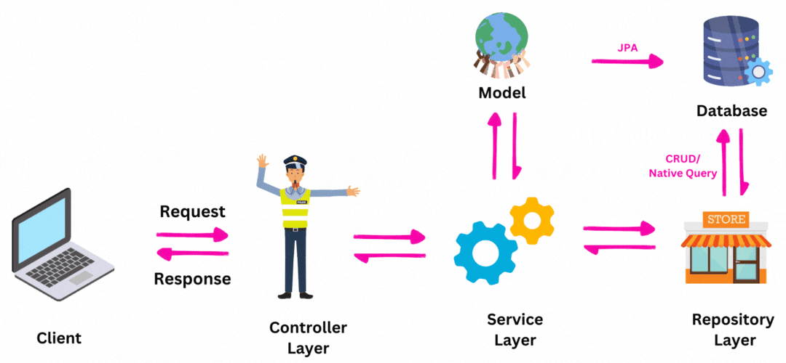

# Hamza Yahiani

Schema de l'architecture de mon Application java Bancaire.

## 1 ControllerLayer :

- Point d'entrée de l'API.
- Reçoit les requêtes HTTP (POST, GET, PUT, DELETE) depuis l'extérieur.
- Transmet les données (comme un `Client`) à `ServiceLayer` pour traitement.
- Récupère la réponse de `ClientService` et renvoie une réponse HTTP au client (application front-end, autre service, etc.).

## 2 ServiceLayer :

- Contient la `logique` métier de l’application.
- Gère les opérations nécessaires pour chaque requête (création, mise à jour, suppression, etc.) en utilisant les méthodes du `RepositoryLayer`
- Peut appliquer des règles spécifiques avant de transmettre les données au dépôt (exemple : vérifier l'existence d'un client avant de l'ajouter).

## 3 RepositoryLayer : 

- S'occupe de l'accès aux données en interagissant directement avec la base de données.
- Étend `JpaRepository` ou `CrudRepository` pour bénéficier des méthodes CRUD de base sans écrire de SQL.
- Traite uniquement les opérations de persistance (sauvegarde, recherche, suppression) et ne contient pas de logique métier.
